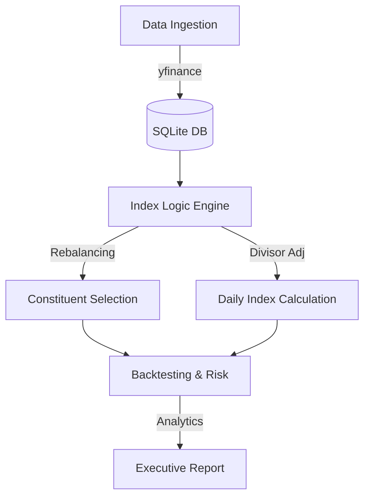

# IndexForge ⚙️📈

[](https://www.python.org/downloads/)
[](LICENSE)
[]()

**IndexForge** is a production-grade, rule-based equity index construction and rebalancing engine. Built to mirror **MSCI Cap-Weighted Index methodologies**, the engine mathematically processes market-capitalizations, adjusts for free-float factors, filters for liquidity screens, and executes semi-annual rebalancing with buffer-rule retention logic.

---

### 👶 ELI5: What does IndexForge do? (For Everyone)

Imagine you have a **"Superstars Club"** for the top 50 biggest and best companies in the world.
1.  **Selection**: Every day, we check who the 50 biggest companies are.
2.  **The Rule**: We don't want the club members changing every single day whenever a company's size moves by $1. That would be chaotic!
3.  **The "Safety Zone" (Buffer)**: We only kick someone out of the club if they fall significantly below the top 50, and we only let a newcomer in if they become significantly bigger than the current members. 
4.  **Math Magic (Divisor)**: When the club members *do* change, we use a special math formula so the club's "Score" (the Index) doesn't just jump up or down artificially just because the members changed. 

**Summary**: IndexForge is the "Superstars Club" manager for the stock market!

---

### ✅ Current Status: 100% Fully Functional
This project is **fully working** and ready for recruitment demos. 
*   **Database**: Uses a lightweight, local SQLite database (`indexforge.db`). No complex Postgres setup required!
*   **Failover**: If the finance data provider is blocked, the engine automatically generates "synthetic" (realistic fake) data so the whole application still runs perfectly. 
*   **Testing**: Includes unit tests ensuring the math is 100% accurate.

---

### 🏆 Industrial-Grade Features (v2)

*   **Algorithmic Rebalancing**: Periodically updates member list based on rank.
*   **Precision Math**: Automated **Divisor Adjustments** for index price continuity.
*   **Advanced Analytics**: Reports **Annualized Volatility** and **Sharpe Ratio** (Risk vs. Reward).
*   **Logging**: Tracks every action in `logs/` for professional auditing.

## 🏗 System Architecture



---

## 🛠 Prerequisites & Installation

To run this project, you only need:
1.  **Python 3.9 or higher**
2.  **`make`** (Available by default on Mac/Linux)

### 1. Setup Environment
```bash
make install
```

### 2. Run the Full Pipeline
Executes the database setup, data ingestion, rebalancing engine, and backtesting suite in one pass.
```bash
make full-run
```

### 3. Run Unit Tests
```bash
make test
```

The resulting executive summary is generated at **`indexforge_report.md`**.

## 📝 Methodology Summary
1.  **Selection Universe**: Top US Mega-Cap equities by Free-Float Market Cap.
2.  **Liquidity Filter**: Minimum 20-day Average Daily Traded Volume (ADTV) threshold.
3.  **Weighting**: Cap-weighted with deterministic Free-Float Factors.
4.  **Rebalancing**: Semi-annual schedule with buffer-zone retention rules to optimize turnover efficiency.

## ⚖️ License
Distributed under the MIT License. See `LICENSE` for more information.
