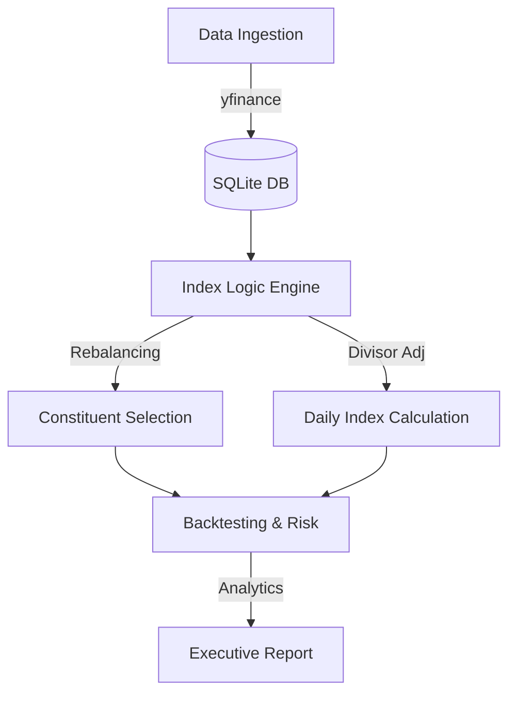

# IndexForge ⚙️📈

[](https://www.python.org/downloads/)
[](LICENSE)
[]()

**IndexForge** is a production-grade, rule-based equity index construction and rebalancing engine. Built to mirror **MSCI Cap-Weighted Index methodologies**, the engine mathematically processes market-capitalizations, adjusts for free-float factors, filters for liquidity screens, and executes semi-annual rebalancing with buffer-rule retention logic.

## 🏆 Industrial-Grade Features (v2)

*   **Algorithmic Rebalancing**: Implements rigorous MSCI semi-annual (May/Nov) selection logic. Includes **Retention Buffers** ($+/- 5$ ranks) to minimize turnover while achieving target constituent counts.
*   **Precision Math**: Fully automated **Divisor Adjustments** ensure index continuity across rebalance events, preventing artificial price gaps.
*   **Advanced Analytics**: Generates professional risk-attribution metrics, including **Annualized Volatility** and **Sharpe Ratio**.
*   **Engineering Robustness**: 
    - **Centralized Config**: All parameters managed in `config/settings.py`.
    - **Structured Logging**: Detailed execution traces in `logs/` for auditability.
    - **Unit Test Suite**: `pytest` coverage for the core financial math modules.
*   **Data Resiliency**: Integrated synthetic geometric brownian motion fallback to ensure demo stability during upstream API rate-limits.

## 🏗 System Architecture



## 🛠 Tech Stack
*   **Engine**: Python 3 (pandas, NumPy, SQLAlchemy)
*   **Storage**: SQLite (Normalized Relational Schema)
*   **Testing**: Pytest
*   **DevOps**: Makefile

---

## 💻 Getting Started

### 1. Setup Environment
```bash
make install
source .venv/bin/activate
```

### 2. Run the Full Pipeline
Executes the database setup, data ingestion, rebalancing engine, and backtesting suite in one pass.
```bash
make full-run
```

### 3. Run Unit Tests
```bash
make test
```

The resulting executive summary is generated at **`indexforge_report.md`**.

## 📝 Methodology Summary
1.  **Selection Universe**: Top US Mega-Cap equities by Free-Float Market Cap.
2.  **Liquidity Filter**: Minimum 20-day Average Daily Traded Volume (ADTV) threshold.
3.  **Weighting**: Cap-weighted with deterministic Free-Float Factors.
4.  **Rebalancing**: Semi-annual schedule with buffer-zone retention rules to optimize turnover efficiency.

## ⚖️ License
Distributed under the MIT License. See `LICENSE` for more information.
